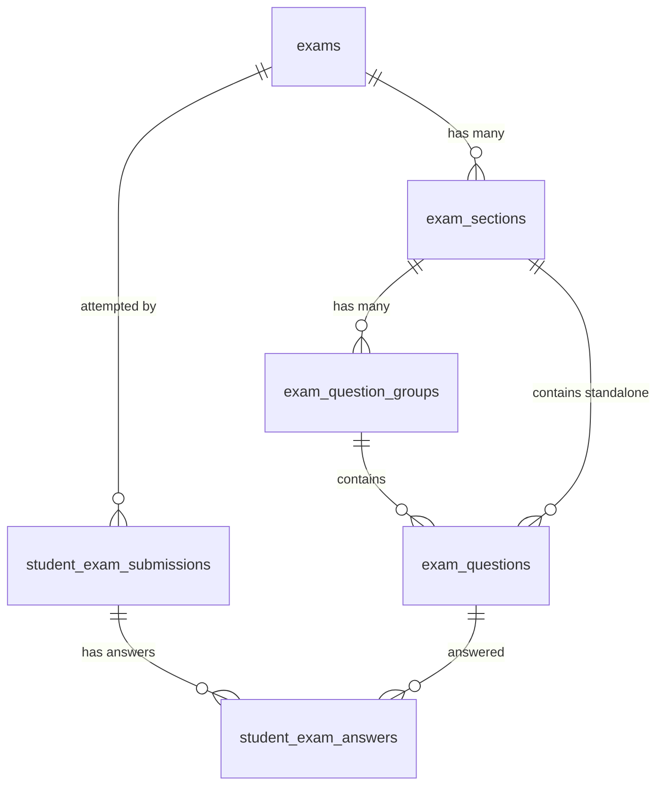

# TÀI LIỆU ĐẶC TẢ CÁC DẠNG CÂU HỎI & HỆ THỐNG THI TRỰC TUYẾN

> **Mục tiêu**: Chuẩn hóa toàn bộ các dạng câu hỏi theo **4 Kỹ năng cốt lõi** (Nghe – Đọc – Viết – Nói) vào cấu trúc dữ liệu JSON phục vụ Backend (Laravel) và Frontend (React + Inertia).
>
> **Phiên bản**: 2.0 — Cập nhật cấu trúc phân kỹ năng  
> **Áp dụng cho**: Tất cả loại đề thi (Trắc nghiệm phổ thông, IELTS, HSK, TOEIC, JLPT, Tự luận)

---

## MỤC LỤC

1. [Ma Trận Kỹ Năng – Mẫu Câu Hỏi](#1-ma-trận-kỹ-năng--mẫu-câu-hỏi)
2. [Chi Tiết 4 Kỹ Năng](#2-chi-tiết-4-kỹ-năng)
   - [2.1 Kỹ Năng Nghe (Listening)](#21-kỹ-năng-nghe-listening)
   - [2.2 Kỹ Năng Đọc (Reading)](#22-kỹ-năng-đọc-reading)
   - [2.3 Kỹ Năng Viết (Writing)](#23-kỹ-năng-viết-writing)
   - [2.4 Kỹ Năng Nói (Speaking)](#24-kỹ-năng-nói-speaking)
3. [Chi Tiết 10 Mẫu Câu Hỏi & Cấu Trúc JSON](#3-chi-tiết-10-mẫu-câu-hỏi--cấu-trúc-json)
4. [Quy Tắc Hiển Thị Media (Audio / Image)](#4-quy-tắc-hiển-thị-media-audio--image)
5. [Mô Hình Phân Cấp Bài Thi](#5-mô-hình-phân-cấp-bài-thi)
6. [Thiết Kế Cơ Sở Dữ Liệu](#6-thiết-kế-cơ-sở-dữ-liệu)
7. [Thuật Toán Chấm Điểm](#7-thuật-toán-chấm-điểm)
8. [Hướng Dẫn Xây Dựng Giao Diện](#8-hướng-dẫn-xây-dựng-giao-diện)

---

## 1. MA TRẬN KỸ NĂNG – MẪU CÂU HỎI

Quy tắc cốt lõi: **Mỗi câu hỏi phải thuộc về đúng một kỹ năng**. Danh sách mẫu câu hỏi khả dụng khi xây dựng đề thi phụ thuộc hoàn toàn vào kỹ năng được chọn.

| Mẫu Câu Hỏi (`question_type`) | 🎧 Nghe | 📖 Đọc | ✍️ Viết | 🎤 Nói | Tự Động Chấm |
|:---|:---:|:---:|:---:|:---:|:---:|
| `single_choice` – Trắc nghiệm 1 đáp án | ✅ | ✅ | ❌ | ❌ | ✅ |
| `multiple_choice` – Trắc nghiệm nhiều đáp án | ✅ | ✅ | ❌ | ❌ | ✅ |
| `true_false_not_given` – Đúng / Sai / Không đề cập | ✅ | ✅ | ❌ | ❌ | ✅ |
| `fill_in_blank` – Điền vào chỗ trống | ✅ | ✅ | ✅ | ❌ | ✅ |
| `matching` – Nối cặp / Ghép tiêu đề | ✅ | ✅ | ❌ | ❌ | ✅ |
| `ordering` – Sắp xếp thứ tự / Ghép câu | ❌ | ✅ | ✅ | ❌ | ✅ |
| `diagram_labelling` – Gán nhãn sơ đồ / Bản đồ | ✅ | ❌ | ❌ | ❌ | ✅ |
| `find_mistake` – Tìm lỗi sai trong câu | ❌ | ✅ | ✅ | ❌ | ✅ |
| `essay` – Tự luận / Viết bài văn | ❌ | ❌ | ✅ | ❌ | ❌ Giáo viên chấm |
| `audio_record` – Ghi âm câu trả lời | ❌ | ❌ | ❌ | ✅ | ❌ Giáo viên / AI chấm |

> **Ràng buộc bắt buộc**: Giao diện frontend **phải lọc chặt** danh sách mẫu câu theo kỹ năng đang được chọn. Không được phép hiển thị hoặc chọn mẫu câu thuộc kỹ năng khác.

---

## 2. CHI TIẾT 4 KỸ NĂNG

### 2.1 Kỹ Năng Nghe (Listening)

- **Màu nhận diện**: Xanh dương (`blue`)
- **Icon**: `Headphones`
- **Ứng dụng**: IELTS Listening, TOEIC Part 1-4, HSK Listening, Đề Nghe Tiếng Anh THPT
- **Mô tả**: Bài thi Nghe hiểu qua file Audio MP3. Học sinh nghe file âm thanh và trả lời câu hỏi.

**Mẫu câu hỏi được phép** (6 loại):

| `question_type` | Ví dụ ứng dụng thực tế |
|:---|:---|
| `single_choice` | TOEIC Part 1, 2, 3; IELTS MCQ |
| `multiple_choice` | IELTS Pick TWO from five |
| `true_false_not_given` | HSK 判断题 (Đúng/Sai), IELTS Listening T/F |
| `fill_in_blank` | IELTS Summary Completion, TOEIC Part 3, 4 |
| `matching` | IELTS Matching speakers/features |
| `diagram_labelling` | IELTS Listening Map Labelling, Plan/Diagram |

**Quy tắc Media**:
- **Audio (`audio_url`)**: **BẮT BUỘC** — Mỗi câu hoặc nhóm câu Nghe phải gắn file audio.
- **Hình ảnh (`image_url`)**: Tùy chọn — Chỉ dùng cho `diagram_labelling` (bản đồ, sơ đồ).

---

### 2.2 Kỹ Năng Đọc (Reading)

- **Màu nhận diện**: Xanh lá (`emerald`)
- **Icon**: `BookOpen`
- **Ứng dụng**: IELTS Reading, TOEIC Part 5-7, HSK Reading, Đọc hiểu Tiếng Anh THPT
- **Mô tả**: Đọc hiểu đoạn văn bản. Học sinh đọc Passage và trả lời các câu hỏi liên quan.

**Mẫu câu hỏi được phép** (7 loại):

| `question_type` | Ví dụ ứng dụng thực tế |
|:---|:---|
| `single_choice` | Trắc nghiệm THPT, TOEIC Part 5, HSK MCQ |
| `multiple_choice` | IELTS Pick TWO from passage |
| `true_false_not_given` | IELTS True/False/Not Given, Yes/No/Not Given |
| `matching` | IELTS Matching Headings, Matching Features |
| `fill_in_blank` | IELTS Summary/Sentence Completion, TOEIC Part 6 |
| `ordering` | Sắp xếp đoạn văn, sắp xếp câu theo trình tự |
| `find_mistake` | HSK 找病句, THPT Tìm lỗi sai phần gạch chân A/B/C/D |

**Quy tắc Media**:
- **Audio (`audio_url`)**: Không sử dụng cho kỹ năng Đọc.
- **Hình ảnh (`image_url`)**: Tùy chọn — Dùng khi câu hỏi liên quan đến biểu đồ, bảng số liệu.

---

### 2.3 Kỹ Năng Viết (Writing)

- **Màu nhận diện**: Vàng cam (`amber`)
- **Icon**: `PenTool`
- **Ứng dụng**: IELTS Writing Task 1 & 2, HSK 4-6 Viết câu / Tóm tắt, Văn học
- **Mô tả**: Học sinh viết bài tự luận, điền từ, sắp xếp từ/câu hoặc tìm lỗi sai trong đoạn văn.

**Mẫu câu hỏi được phép** (4 loại):

| `question_type` | Ví dụ ứng dụng thực tế |
|:---|:---|
| `essay` | IELTS Writing Task 1 & 2, Viết đoạn văn tự do |
| `ordering` | HSK 连词成句 (Xếp từ thành câu), JLPT Sắp xếp `★` |
| `fill_in_blank` | Điền từ vào chỗ trống, Cloze test chọn từ từ Word Bank |
| `find_mistake` | HSK 5-6 找病句, Tìm phần gạch chân sai ngữ pháp |

**Quy tắc Media**:
- **Audio (`audio_url`)**: Không sử dụng cho kỹ năng Viết.
- **Hình ảnh (`image_url`)**: Tùy chọn — Dùng cho IELTS Writing Task 1 (biểu đồ, sơ đồ cần mô tả).

---

### 2.4 Kỹ Năng Nói (Speaking)

- **Màu nhận diện**: Hồng (`pink`)
- **Icon**: `Mic`
- **Ứng dụng**: IELTS Speaking Part 1/2/3, HSKK Khẩu ngữ Sơ/Trung/Cao cấp
- **Mô tả**: Học sinh ghi âm trực tiếp câu trả lời qua micro trình duyệt. Giáo viên hoặc AI nghe và chấm điểm.

**Mẫu câu hỏi được phép** (1 loại):

| `question_type` | Ví dụ ứng dụng thực tế |
|:---|:---|
| `audio_record` | IELTS Speaking Part 1, 2, 3; HSKK Sơ/Trung/Cao cấp |

**Quy tắc Media**:
- **Audio đề bài (`audio_url`)**: Tùy chọn — Dùng khi giáo viên muốn phát câu hỏi bằng giọng nói.
- **Hình ảnh (`image_url`)**: Tùy chọn — Dùng cho Speaking Part 2 (Task card có hình minh họa).

---

## 3. CHI TIẾT 10 MẪU CÂU HỎI & CẤU TRÚC JSON

Mỗi câu hỏi lưu trong bảng `exam_questions` với cấu trúc:
- `skill`: Kỹ năng câu hỏi (`listening` | `reading` | `writing` | `speaking`).
- `question_type`: Mẫu câu hỏi (1 trong 10 loại).
- `content`: Nội dung câu hỏi (text hoặc HTML/Markdown).
- `options`: JSON chứa danh sách lựa chọn, cặp nối, hoặc danh sách từ.
- `correct_answer`: JSON lưu đáp án chuẩn.
- `explanation`: Giải thích đáp án.
- `metadata`: Cấu hình mở rộng (giới hạn từ, đếm từ, rubrics...).
- `audio_url`: Đường dẫn file MP3 (chủ yếu dùng cho kỹ năng Nghe).
- `image_url`: Đường dẫn hình ảnh đính kèm (tùy theo loại câu).

---

### 3.1 `single_choice` — Trắc nghiệm 1 đáp án

**Kỹ năng**: 🎧 Nghe | 📖 Đọc  
**Đặc điểm**: Học sinh chỉ chọn 1 trong các phương án (Radio buttons).

```json
{
  "skill": "listening",
  "question_type": "single_choice",
  "content": "What is the woman's job?",
  "audio_url": "/storage/exams/audio/section1.mp3",
  "image_url": null,
  "options": [
    { "id": "A", "text": "Teacher" },
    { "id": "B", "text": "Doctor" },
    { "id": "C", "text": "Engineer" },
    { "id": "D", "text": "Nurse" }
  ],
  "correct_answer": "B",
  "explanation": "The woman says she works at the hospital as a medical professional."
}
```

**Câu trả lời học sinh**: `"B"`

---

### 3.2 `multiple_choice` — Trắc nghiệm nhiều đáp án

**Kỹ năng**: 🎧 Nghe | 📖 Đọc  
**Đặc điểm**: Học sinh chọn 2 hoặc nhiều phương án đúng (Checkboxes). Ví dụ: *Choose TWO letters, A-E*.

```json
{
  "skill": "reading",
  "question_type": "multiple_choice",
  "content": "Which TWO benefits of exercising are mentioned in the passage?",
  "image_url": null,
  "metadata": {
    "max_select": 2
  },
  "options": [
    { "id": "A", "text": "Improves cardiovascular health" },
    { "id": "B", "text": "Eliminates the need for proper diet" },
    { "id": "C", "text": "Reduces chronic stress and anxiety" },
    { "id": "D", "text": "Guarantees rapid weight loss" },
    { "id": "E", "text": "Prevents all infectious illnesses" }
  ],
  "correct_answer": ["A", "C"],
  "explanation": "The passage explicitly highlighted heart health (A) and stress reduction (C)."
}
```

**Câu trả lời học sinh**: `["A", "C"]`

---

### 3.3 `true_false_not_given` — Đúng / Sai / Không đề cập

**Kỹ năng**: 🎧 Nghe | 📖 Đọc  
**Đặc điểm**: Dạng kinh điển IELTS (`TRUE / FALSE / NOT GIVEN`, `YES / NO / NOT GIVEN`) và HSK (Đúng `对` / Sai `错`).

```json
{
  "skill": "reading",
  "question_type": "true_false_not_given",
  "content": "The original building was completely destroyed during the Great Fire.",
  "metadata": {
    "variant": "T_F_NG"
  },
  "options": [
    { "id": "TRUE", "label": "True (Đúng)" },
    { "id": "FALSE", "label": "False (Sai)" },
    { "id": "NOT_GIVEN", "label": "Not Given (Không có thông tin)" }
  ],
  "correct_answer": "FALSE",
  "explanation": "Paragraph 2 states that half of the building survived the fire."
}
```

> **Biến thể `variant`**:
> - `"T_F_NG"` → True / False / Not Given (IELTS Reading/Listening)
> - `"Y_N_NG"` → Yes / No / Not Given (IELTS Reading)
> - `"T_F"` → Đúng / Sai (HSK 判断题)

**Câu trả lời học sinh**: `"FALSE"`

---

### 3.4 `fill_in_blank` — Điền vào chỗ trống / Cloze Test

**Kỹ năng**: 🎧 Nghe | 📖 Đọc | ✍️ Viết  
**Đặc điểm**: Đoạn văn có các vị trí đánh dấu `[blank_1]`, `[blank_2]`. Cho phép tự gõ hoặc chọn từ Word Bank.

```json
{
  "skill": "listening",
  "question_type": "fill_in_blank",
  "content": "The conference will be held in [blank_1] on [blank_2].",
  "audio_url": "/storage/exams/audio/conference_talk.mp3",
  "metadata": {
    "word_limit": "NO MORE THAN TWO WORDS",
    "word_bank": []
  },
  "correct_answer": {
    "blank_1": {
      "accepted_answers": ["London", "Central London"],
      "case_sensitive": false
    },
    "blank_2": {
      "accepted_answers": ["15th October", "October 15", "October 15th"],
      "case_sensitive": false
    }
  },
  "explanation": "The audio mentions the event is hosted in London on October 15th."
}
```

**Câu trả lời học sinh**: `{ "blank_1": "London", "blank_2": "15th October" }`

---

### 3.5 `matching` — Nối cặp / Ghép tiêu đề / Ghép tranh

**Kỹ năng**: 🎧 Nghe | 📖 Đọc  
**Đặc điểm**: Cột trái ghép với Cột phải. Dùng trong IELTS Matching Headings, HSK Ghép tranh với hội thoại.

```json
{
  "skill": "reading",
  "question_type": "matching",
  "content": "Match each paragraph with its most suitable heading:",
  "options": {
    "left_items": [
      { "id": "para_a", "label": "Paragraph A" },
      { "id": "para_b", "label": "Paragraph B" },
      { "id": "para_c", "label": "Paragraph C" }
    ],
    "right_items": [
      { "id": "h_1", "text": "i. Early discovery and origins" },
      { "id": "h_2", "text": "ii. Environmental and economic impacts" },
      { "id": "h_3", "text": "iii. Future prospects and challenges" },
      { "id": "h_4", "text": "iv. Unsuccessful early experiments" }
    ]
  },
  "correct_answer": {
    "para_a": "h_1",
    "para_b": "h_4",
    "para_c": "h_2"
  },
  "explanation": "Para A = origins (i), Para B = failed attempts (iv), Para C = impacts (ii)."
}
```

**Câu trả lời học sinh**: `{ "para_a": "h_1", "para_b": "h_4", "para_c": "h_2" }`

---

### 3.6 `ordering` — Sắp xếp thứ tự / Ghép câu

**Kỹ năng**: 📖 Đọc | ✍️ Viết  
**Đặc điểm**: Đưa ra các mảnh ghép bị xáo trộn. Học sinh kéo thả hoặc bấm chọn đúng thứ tự. Phổ biến trong **HSK 3-5 (连词成句)** và **JLPT (Dạng dấu `★`)**.

```json
{
  "skill": "writing",
  "question_type": "ordering",
  "content": "Sắp xếp các cụm từ sau để tạo thành câu hoàn chỉnh đúng ngữ pháp:",
  "options": [
    { "id": "t1", "text": "这本书" },
    { "id": "t2", "text": "请你" },
    { "id": "t3", "text": "借给" },
    { "id": "t4", "text": "王老师" }
  ],
  "correct_answer": ["t2", "t1", "t3", "t4"],
  "explanation": "Câu đúng: 请你这本书借给王老师 — Cấu trúc câu cầu khiến: 主语 + 请 + 宾语 + 动词 + 对象."
}
```

**Câu trả lời học sinh**: `["t2", "t1", "t3", "t4"]`

---

### 3.7 `diagram_labelling` — Gán nhãn sơ đồ / Bản đồ

**Kỹ năng**: 🎧 Nghe  
**Đặc điểm**: Hiển thị bản đồ hoặc sơ đồ có các vị trí ghim A, B, C... Học sinh nghe audio và gán tên địa danh/bộ phận vào đúng vị trí.

```json
{
  "skill": "listening",
  "question_type": "diagram_labelling",
  "content": "Label the map below with the correct room locations:",
  "audio_url": "/storage/exams/audio/library_tour.mp3",
  "image_url": "/storage/exams/images/library_layout.png",
  "options": {
    "labels": [
      { "id": "loc_1", "text": "Computer Laboratory" },
      { "id": "loc_2", "text": "Main Auditorium" },
      { "id": "loc_3", "text": "Periodicals Room" }
    ],
    "map_pins": ["A", "B", "C", "D", "E", "F"]
  },
  "correct_answer": {
    "loc_1": "B",
    "loc_2": "E",
    "loc_3": "A"
  }
}
```

> ⚠️ **Lưu ý**: `diagram_labelling` là mẫu câu **duy nhất trong kỹ năng Nghe** yêu cầu cả `audio_url` lẫn `image_url`.

**Câu trả lời học sinh**: `{ "loc_1": "B", "loc_2": "E", "loc_3": "A" }`

---

### 3.8 `find_mistake` — Tìm lỗi sai trong câu

**Kỹ năng**: 📖 Đọc | ✍️ Viết  
**Đặc điểm**: Câu có 4 phần gạch chân A, B, C, D. Học sinh chọn phần bị sai ngữ pháp/dùng từ. Dùng trong HSK 5-6 (找病句) và THPT.

```json
{
  "skill": "reading",
  "question_type": "find_mistake",
  "content": "Chọn phần gạch chân chứa lỗi sai ngữ pháp trong câu sau:",
  "sentence_segments": [
    { "id": "normal_1", "text": "Although he " },
    { "id": "A", "text": "was exhausted", "underlined": true },
    { "id": "normal_2", "text": ", but he " },
    { "id": "B", "text": "continued", "underlined": true },
    { "id": "normal_3", "text": " to work " },
    { "id": "C", "text": "until", "underlined": true },
    { "id": "normal_4", "text": " late at " },
    { "id": "D", "text": "midnight", "underlined": true },
    { "id": "normal_5", "text": "." }
  ],
  "correct_answer": "B",
  "explanation": "Trong tiếng Anh không dùng cả 'Although' và 'but' trong cùng một câu ghép. Phải xóa 'but'."
}
```

**Câu trả lời học sinh**: `"B"`

---

### 3.9 `essay` — Tự luận / Viết bài văn

**Kỹ năng**: ✍️ Viết  
**Đặc điểm**: Học sinh nhập văn bản dài. Giao diện có bộ đếm từ trực tiếp (Word Count), cảnh báo số từ tối thiểu. **Không tự động chấm điểm** — Giáo viên chấm theo Rubrics.

```json
{
  "skill": "writing",
  "question_type": "essay",
  "content": "You should spend about 40 minutes on this task.\n\nWrite about the following topic:\nSome people think that universities should provide graduates with the knowledge and skills needed in the workplace...\n\nWrite at least 250 words.",
  "image_url": null,
  "metadata": {
    "min_words": 250,
    "max_words": 500,
    "rubrics": [
      { "criteria": "Task Achievement", "max_score": 2.5 },
      { "criteria": "Coherence and Cohesion", "max_score": 2.5 },
      { "criteria": "Lexical Resource", "max_score": 2.5 },
      { "criteria": "Grammatical Range and Accuracy", "max_score": 2.5 }
    ]
  },
  "correct_answer": null,
  "sample_answer": "Sample Band 8.0 essay text..."
}
```

**Câu trả lời học sinh**: `{ "text": "Nowadays, there is an ongoing debate...", "word_count": 285 }`

---

### 3.10 `audio_record` — Ghi âm câu trả lời / Speaking

**Kỹ năng**: 🎤 Nói  
**Đặc điểm**: Học sinh nhấn nút Ghi âm qua Microphone API trình duyệt. **Không tự động chấm điểm** — Giáo viên hoặc AI nghe và chấm theo Rubrics.

```json
{
  "skill": "speaking",
  "question_type": "audio_record",
  "content": "Describe a book that you have recently read and found interesting.\nYou should say:\n- What the book is\n- Who wrote it\n- What it is about\nand explain why you found it interesting.",
  "image_url": null,
  "metadata": {
    "prep_time_seconds": 60,
    "max_record_duration_seconds": 120
  },
  "correct_answer": null,
  "explanation": "Focus on fluency, coherent transitions, range of vocabulary, and clear pronunciation."
}
```

**Câu trả lời học sinh**: `{ "audio_url": "/storage/submissions/audio/student_102_q5.mp3", "duration_seconds": 115 }`

---

## 4. QUY TẮC HIỂN THỊ MEDIA (AUDIO / IMAGE)

### 4.1 Bảng Tổng Hợp

| Kỹ Năng | `audio_url` | `image_url` | Ghi chú |
|:---|:---:|:---:|:---|
| 🎧 **Nghe** (listening) | **Bắt buộc** | Tùy chọn | Audio là thành phần bắt buộc. Image chỉ dùng cho `diagram_labelling`. |
| 📖 **Đọc** (reading) | ❌ Không dùng | Tùy chọn | Không cần audio. Image khi cần minh họa biểu đồ. |
| ✍️ **Viết** (writing) | ❌ Không dùng | Tùy chọn | Image cho IELTS Writing Task 1 (biểu đồ cần mô tả). |
| 🎤 **Nói** (speaking) | Tùy chọn | Tùy chọn | Audio là câu hỏi nói ra bằng giọng (nếu có). Image cho Task Card. |

### 4.2 Quy Tắc Frontend

- **Trường `audio_url`** chỉ hiển thị khi câu hỏi thuộc kỹ năng `listening`.
- **Trường `image_url`** hiển thị có điều kiện: ẩn mặc định, giáo viên chủ động bật lên khi cần.
- Đối với mẫu `diagram_labelling`: **tự động hiển thị cả hai** trường Audio và Image.
- Đối với mẫu `audio_record`: **không hiển thị** trường `audio_url` ở phần nhập liệu đề bài (file audio là đầu ra của học sinh).

---

## 5. MÔ HÌNH PHÂN CẤP BÀI THI

```
[EXAM: Đề Thi IELTS Mock Test 01]
 │
 ├── [SECTION: LISTENING — 40 phút]   (skill = "listening")
 │    ├── [QUESTION GROUP 1: Audio Section 1 — Hội thoại thuê nhà]
 │    │    ├── Q1: fill_in_blank  (Tên người thuê)
 │    │    ├── Q2: fill_in_blank  (Số điện thoại)
 │    │    └── Q3: single_choice  (Phương thức thanh toán)
 │    │
 │    └── [QUESTION GROUP 2: Audio Section 2 — Bản đồ công viên]
 │         └── Q4→Q8: diagram_labelling  (Map Pins A-F)
 │
 ├── [SECTION: READING — 60 phút]   (skill = "reading")
 │    ├── [QUESTION GROUP 3: Passage 1 — The History of Silk]
 │    │    ├── Q9→Q14:  true_false_not_given
 │    │    └── Q15→Q20: matching  (Matching Headings)
 │    │
 │    └── [QUESTION GROUP 4: Passage 2 — Renewable Energy]
 │         └── Q21→Q27: fill_in_blank  (Summary Completion)
 │
 ├── [SECTION: WRITING — 60 phút]   (skill = "writing")
 │    ├── [QUESTION GROUP 5: Writing Task 1]
 │    │    └── Q28: essay  (Mô tả biểu đồ — min 150 words)
 │    │
 │    └── [QUESTION GROUP 6: Writing Task 2]
 │         └── Q29: essay  (Viết luận — min 250 words)
 │
 └── [SECTION: SPEAKING — 15 phút]   (skill = "speaking")
      ├── [QUESTION GROUP 7: Part 1 — Introduction]
      │    └── Q30→Q32: audio_record  (Câu hỏi ngắn cá nhân)
      │
      └── [QUESTION GROUP 8: Part 2 — Long Turn]
           └── Q33: audio_record  (Task Card — prep 60s, record max 120s)
```

### Cấu Trúc Phân Cấp

1. **`Exam`** — Bài thi tổng thể: thời gian, điểm tối đa, trung tâm, lớp học.
2. **`ExamSection`** — Phần thi tương ứng một kỹ năng: Listening, Reading, Writing, Speaking.
3. **`ExamQuestionGroup`** — Ngữ cảnh dùng chung: đoạn văn đọc (Passage), file audio nghe chung, sơ đồ bản đồ, hướng dẫn làm bài.
4. **`ExamQuestion`** — Câu hỏi chi tiết, có thuộc tính `skill` xác định kỹ năng.

---

## 6. THIẾT KẾ CƠ SỞ DỮ LIỆU



### Bảng `exams` (Bài thi)
| Cột | Kiểu | Mô tả |
|:---|:---|:---|
| `id` | BIGINT PK | |
| `center_id` | BIGINT FK | Trung tâm sở hữu đề thi |
| `class_id` | BIGINT NULLABLE FK | Lớp học (nếu là bài thi theo lớp) |
| `subject_id` | BIGINT NULLABLE FK | Môn học |
| `code` | VARCHAR | Mã bài thi tự sinh: `EXM000000001` |
| `name` | VARCHAR | Tên bài thi |
| `exam_type` | VARCHAR | `general`, `ielts`, `hsk`, `toeic`, `custom` |
| `duration_minutes` | INT | Thời gian làm bài (phút) |
| `max_score` | DECIMAL(5,2) | Điểm tối đa (VD: 9.0, 10.00, 100.00) |
| `pass_score` | DECIMAL(5,2) NULLABLE | Điểm đạt |
| `shuffle_questions` | BOOLEAN | Đảo thứ tự câu hỏi |
| `shuffle_options` | BOOLEAN | Đảo thứ tự A/B/C/D |
| `max_attempts` | INT | Số lần làm bài tối đa (default: 1) |
| `status` | ENUM | `draft`, `published`, `completed`, `cancelled` |

### Bảng `exam_sections` (Phần thi theo kỹ năng)
| Cột | Kiểu | Mô tả |
|:---|:---|:---|
| `id` | BIGINT PK | |
| `exam_id` | BIGINT FK | |
| `title` | VARCHAR | VD: "Listening", "Reading Passage 1" |
| `order_index` | INT | Thứ tự hiển thị |
| `time_limit_minutes` | INT NULLABLE | Giới hạn thời gian riêng từng section |

### Bảng `exam_question_groups` (Ngữ cảnh / Bài đọc / File nghe chung)
| Cột | Kiểu | Mô tả |
|:---|:---|:---|
| `id` | BIGINT PK | |
| `section_id` | BIGINT FK | |
| `title` | VARCHAR NULLABLE | VD: "Read the passage and answer Q1-5" |
| `passage_content` | LONGTEXT NULLABLE | Đoạn văn đọc dài (hỗ trợ HTML/Rich Text) |
| `audio_url` | VARCHAR NULLABLE | File MP3 nghe chung cho cả nhóm câu hỏi |
| `image_url` | VARCHAR NULLABLE | Ảnh sơ đồ / bản đồ dùng chung |
| `audio_max_plays` | INT DEFAULT 1 | Số lần tối đa được nghe audio |
| `order_index` | INT | |

### Bảng `exam_questions` (Câu hỏi chi tiết)
| Cột | Kiểu | Mô tả |
|:---|:---|:---|
| `id` | BIGINT PK | |
| `group_id` | BIGINT NULLABLE FK | Thuộc nhóm câu hỏi (nếu có) |
| `section_id` | BIGINT FK | Thuộc phần thi |
| `code` | VARCHAR | Mã câu hỏi: `Q000000001` |
| `skill` | VARCHAR(50) | **`listening`**, **`reading`**, **`writing`**, **`speaking`** |
| `question_type` | VARCHAR | Một trong 10 mẫu câu hỏi (xem Ma Trận §1) |
| `content` | TEXT | Nội dung câu hỏi |
| `image_url` | VARCHAR NULLABLE | Hình ảnh đính kèm (tùy điều kiện §4) |
| `audio_url` | VARCHAR NULLABLE | File audio đính kèm (tùy điều kiện §4) |
| `score` | DECIMAL(5,2) | Điểm câu hỏi (default: 1.00) |
| `options` | JSON NULLABLE | Cấu hình lựa chọn A/B/C/D, cặp nối, word bank... |
| `correct_answer` | JSON NULLABLE | Đáp án đúng |
| `explanation` | TEXT NULLABLE | Giải thích chi tiết đáp án |
| `metadata` | JSON NULLABLE | Giới hạn từ, rubrics, cấu hình mở rộng |
| `order_index` | INT | |

### Bảng `student_exam_submissions` (Lượt làm bài)
| Cột | Kiểu | Mô tả |
|:---|:---|:---|
| `id` | BIGINT PK | |
| `exam_id` | BIGINT FK | |
| `student_id` | BIGINT FK | |
| `started_at` | DATETIME | Thời điểm bắt đầu làm bài |
| `submitted_at` | DATETIME NULLABLE | Thời điểm nộp bài |
| `total_score` | DECIMAL(5,2) NULLABLE | Tổng điểm đạt được |
| `status` | ENUM | `in_progress`, `submitted`, `grading`, `completed` |
| `graded_by` | BIGINT NULLABLE FK | Teacher/Admin chấm tự luận |
| `teacher_feedback` | TEXT NULLABLE | Nhận xét tổng quát của giáo viên |

### Bảng `student_exam_answers` (Câu trả lời chi tiết)
| Cột | Kiểu | Mô tả |
|:---|:---|:---|
| `id` | BIGINT PK | |
| `submission_id` | BIGINT FK | |
| `question_id` | BIGINT FK | |
| `student_answer` | JSON NULLABLE | Đáp án học sinh đã chọn/gõ/ghi âm |
| `is_correct` | BOOLEAN NULLABLE | Đúng/Sai (chỉ với câu tự chấm) |
| `earned_score` | DECIMAL(5,2) | Điểm đạt được (default: 0.00) |
| `teacher_comment` | TEXT NULLABLE | Nhận xét riêng từng câu |

---

## 7. THUẬT TOÁN CHẤM ĐIỂM

| Mẫu Câu Hỏi | Logic So Khớp | Quy Tắc Tính Điểm |
|:---|:---|:---|
| `single_choice` / `true_false_not_given` / `find_mistake` | So khớp chính xác chuỗi: `student === correct` | Đúng: 100% điểm câu; Sai: 0. |
| `multiple_choice` | So khớp 2 mảng (không phân biệt thứ tự): `array_diff(student, correct) === []` | All-or-nothing hoặc tỉ lệ số đáp án đúng. |
| `fill_in_blank` | Chuẩn hóa: `trim()`, `strtolower()` nếu `case_sensitive=false`. Kiểm tra trong `accepted_answers`. | Điểm theo tỉ lệ: `(số ô đúng / tổng số ô) × điểm câu`. |
| `matching` / `diagram_labelling` | So khớp từng cặp key-value trong JSON. | `(số cặp đúng / tổng số cặp) × điểm câu`. |
| `ordering` | So khớp mảng thứ tự chính xác: `JSON.stringify(student) === JSON.stringify(correct)` | Đúng toàn bộ: 100%; Sai: 0. |
| `essay` / `audio_record` | ❌ Không tự chấm điểm | Trạng thái bài thi chuyển sang `grading`. Giáo viên/AI nhập điểm theo Rubric. |

---

## 8. HƯỚNG DẪN XÂY DỰNG GIAO DIỆN

### 8.1 Trang Xây Dựng Đề Thi (Question Builder)

1. **Chọn Kỹ Năng trước**: Khi thêm câu hỏi mới, giáo viên phải chọn kỹ năng (Nghe / Đọc / Viết / Nói) **trước** khi chọn mẫu câu hỏi.
2. **Lọc mẫu câu theo kỹ năng**: Danh sách mẫu câu hiển thị **chỉ những loại tương thích** với kỹ năng đã chọn (xem Ma Trận §1). Các mẫu câu không tương thích phải bị ẩn hoàn toàn.
3. **Hiển thị Media có điều kiện**:
   - Trường `audio_url` chỉ xuất hiện khi kỹ năng là `listening`.
   - Trường `image_url` ẩn mặc định, giáo viên chủ động bật.
   - `diagram_labelling` tự động mở cả hai trường.

### 8.2 Giao Diện Làm Bài (Exam Taking)

1. **Split-Screen Layout** (cho Reading/Listening):
   - **Cột trái (50%)**: Hiển thị cố định Đoạn văn (Passage) hoặc Audio Player.
   - **Cột phải (50%)**: Danh sách câu hỏi, cuộn độc lập.

2. **Question Navigator**:
   - Danh sách nút số `[1] [2] [3] ... [40]`.
   - *Xám*: Chưa làm / *Xanh lá*: Đã trả lời / *Cam/Cờ*: Đánh dấu xem lại.

3. **Chống Gian Lận Cơ Bản**:
   - Cảnh báo khi chuyển tab trình duyệt (`visibilitychange` / `window.onblur`).
   - Tự động nộp bài khi hết giờ (đồng bộ thời gian từ Server).

4. **Auto-Save**:
   - Lưu tạm vào `localStorage` khi học sinh trả lời.
   - Gửi API ngầm định kỳ (Debounced) để tránh mất bài khi mất mạng.
