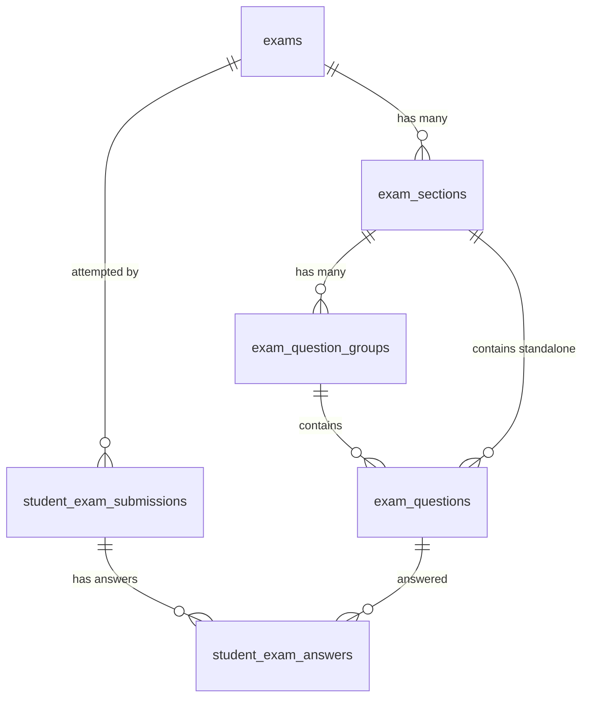

# TÀI LIỆU ĐẶC TẢ CÁC DẠNG CÂU HỎI VÀ THIẾT KẾ HỆ THỐNG THI TRỰC TUYẾN (ONLINE EXAM SYSTEM SPECIFICATION)

> **Mục tiêu**: Chuẩn hóa toàn bộ các dạng câu hỏi thực tế trong các kỳ thi (**Trắc nghiệm phổ thông, IELTS, HSK - Tiếng Trung, TOEIC, JLPT, Tự luận**) thành cấu trúc dữ liệu JSON chuẩn để phục vụ việc lập trình Backend (Laravel) và Frontend (React + Inertia).

---

## MỤC LỤC
1. [Bảng Phân Loại Tổng Hợp 10 Kiểu Câu Hỏi Cốt Lõi](#1-bảng-phân-loại-tổng-hợp-10-kiểu-câu-hỏi-cốt-lõi)
2. [Chi Tiết Từng Dạng Câu Hỏi & Cấu Trúc Dữ Liệu JSON](#2-chi-tiết-từng-dạng-câu-hỏi--cấu-trúc-dữ-liệu-json)
   - [2.1 Single Choice (Trắc nghiệm 1 đáp án)](#21-single_choice---trắc-nghiệm-1-đáp-án)
   - [2.2 Multiple Choice (Trắc nghiệm nhiều đáp án)](#22-multiple_choice---trắc-nghiệm-nhiều-đáp-án)
   - [2.3 True / False / Not Given (Đúng / Sai / Không nhắc đến)](#23-true_false_not_given---đúng--sai--không-nhắc-đến)
   - [2.4 Fill in the Blanks (Điền vào chỗ trống / Cloze Test)](#24-fill_in_blank---điền-vào-chỗ-trống--cloze-test)
   - [2.5 Matching Pairs (Nối cặp / Ghép tiêu đề / Ghép tranh)](#25-matching---nối-cặp--ghép-tiêu-đề--ghép-tranh)
   - [2.6 Ordering / Drag & Drop (Sắp xếp thứ tự / Sắp xếp câu)](#26-ordering---sắp-xếp-thứ-tự--sắp-xếp-từ-thành-câu)
   - [2.7 Map / Diagram Labelling (Gán nhãn sơ đồ / Bản đồ)](#27-diagram_labelling---gán-nhãn-sơ-đồ--bản-đồ)
   - [2.8 Find the Mistake (Tìm lỗi sai trong câu - HSK 5/6, THPT)](#28-find_mistake---tìm-lỗi-sai-trong-câu)
   - [2.9 Essay / Writing (Tự luận / Viết đoạn / IELTS Writing)](#29-essay---tự-luận--viết-đoạn--ielts-writing)
   - [2.10 Audio Record / Speaking (Ghi âm / Khẩu ngữ HSKK / IELTS Speaking)](#210-audio_record---ghi-âm-trả-lời--speaking)
3. [Mô Hình Nhóm Câu Hỏi & Đoạn Văn / File Nghe Dùng Chung (Passage / Audio Groups)](#3-mô-hình-nhóm-câu-hỏi--đoạn-văn--file-nghe-dùng-chung)
4. [Thiết Kế Cơ Sở Dữ Liệu (Database Schema Design)](#4-thiết-kế-cơ-sở-dữ-liệu-database-schema-design)
5. [Thuật Toán Chấm Điểm (Grading Engine Algorithms)](#5-thuật-toán-chấm-điểm-grading-engine-algorithms)

---

## 1. BẢNG PHÂN LOẠI TỔNG HỢP 10 KIỂU CÂU HỎI CỐT LÕI

| STT | Enum Code (`question_type`) | Tên Kiểu Câu Hỏi | Ứng Dụng Thực Tế (IELTS / HSK / TOEIC / THPT) | Tự Động Chấm (Auto-Grade) |
|:---:|:---|:---|:---|:---:|
| **1** | `single_choice` | Trắc nghiệm chọn 1 đáp án | Trắc nghiệm THPT, TOEIC Part 1, 2, 5, HSK 1-4, IELTS MCQs | ✅ Có |
| **2** | `multiple_choice` | Trắc nghiệm chọn nhiều đáp án | IELTS Pick 2/3 out of 5/7, Trắc nghiệm phức hợp | ✅ Có |
| **3** | `true_false_not_given` | Đúng / Sai / Không đề cập | IELTS Reading/Listening (True/False/Not Given; Yes/No/Not Given), HSK 判断题 | ✅ Có |
| **4** | `fill_in_blank` | Điền vào chỗ trống | IELTS Summary/Sentence Completion, HSK 选词填空, TOEIC Part 6 | ✅ Có (Khớp từ/Regex) |
| **5** | `matching` | Nối cột / Ghép cặp / Ghép tranh | IELTS Matching Headings/Features/Information, HSK 选图片, Nối từ | ✅ Có |
| **6** | `ordering` | Sắp xếp thứ tự / Sắp xếp câu | HSK 连词成句 (Xếp từ thành câu), JLPT Sắp xếp `★`, Sắp xếp đoạn văn | ✅ Có |
| **7** | `diagram_labelling` | Gán nhãn bản đồ / sơ đồ | IELTS Listening Map/Plan, IELTS Reading Diagram Labelling | ✅ Có |
| **8** | `find_mistake` | Tìm phần gạch chân sai / Tìm lỗi câu | HSK 5-6 找病句, Tiếng Anh THPT Tìm lỗi sai trong 4 phần gạch chân | ✅ Có |
| **9** | `essay` | Tự luận / Viết bài văn | IELTS Writing Task 1 & 2, HSK 4-6 Viết câu theo tranh / Tóm tắt, Văn học | ❌ Giáo viên chấm |
| **10** | `audio_record` | Ghi âm câu trả lời | IELTS Speaking Part 1, 2, 3; HSKK Khẩu ngữ Sơ - Trung - Cao cấp | ❌ Giáo viên / AI chấm |

---

## 2. CHI TIẾT TỪNG DẠNG CÂU HỎI & CẤU TRÚC DỮ LIỆU JSON

Mỗi câu hỏi lưu trong bảng `exam_questions` sẽ có các trường:
- `content`: Nội dung câu hỏi (chấp nhận text hoặc HTML/Markdown).
- `question_type`: Chuỗi enum (1 trong 10 loại trên).
- `options`: JSON chứa danh sách các lựa chọn, cặp nối, hoặc danh sách từ gợi ý.
- `correct_answer`: JSON lưu đáp án chuẩn để hệ thống tự chấm.
- `explanation`: Giải thích chi tiết đáp án.
- `metadata`: Cấu hình mở rộng (giới hạn từ, đếm từ, âm thanh riêng, hình ảnh kèm theo...).

---

### 2.1 `single_choice` - Trắc nghiệm 1 đáp án
* **Đặc điểm**: Học sinh chỉ được chọn duy nhất 1 trong danh sách phương án (Radio buttons).
* **Cấu trúc JSON**:

```json
{
  "question_type": "single_choice",
  "content": "What is the capital city of Australia?",
  "image_url": null,
  "audio_url": null,
  "options": [
    { "id": "A", "text": "Sydney" },
    { "id": "B", "text": "Melbourne" },
    { "id": "C", "text": "Canberra" },
    { "id": "D", "text": "Brisbane" }
  ],
  "correct_answer": "C",
  "explanation": "Canberra is the designated capital city of Australia."
}
```
* **Dữ liệu trả lời của học sinh (`student_answer`)**:
```json
"C"
```

---

### 2.2 `multiple_choice` - Trắc nghiệm nhiều đáp án
* **Đặc điểm**: Học sinh chọn 2 hoặc nhiều phương án đúng (Checkboxes). Ví dụ: *Choose TWO letters, A-E*.
* **Cấu trúc JSON**:

```json
{
  "question_type": "multiple_choice",
  "content": "Which TWO benefits of exercising are mentioned in the lecture?",
  "metadata": {
    "max_select": 2
  },
  "options": [
    { "id": "A", "text": "Improves cardiovascular health" },
    { "id": "B", "text": "Eliminates the need for proper diet" },
    { "id": "C", "text": "Reduces chronic stress and anxiety" },
    { "id": "D", "text": "Guarantees rapid weight gain" },
    { "id": "E", "text": "Prevents all infectious illnesses" }
  ],
  "correct_answer": ["A", "C"],
  "explanation": "The speaker explicitly highlighted heart health (A) and stress reduction (C)."
}
```
* **Dữ liệu trả lời của học sinh (`student_answer`)**:
```json
["A", "C"]
```

---

### 2.3 `true_false_not_given` - Đúng / Sai / Không nhắc đến
* **Đặc điểm**: Dạng kinh điển của IELTS Reading (`TRUE / FALSE / NOT GIVEN` hoặc `YES / NO / NOT GIVEN`) và HSK (Đúng `对` / Sai `错`).
* **Cấu trúc JSON**:

```json
{
  "question_type": "true_false_not_given",
  "content": "The original building was completely destroyed during the Great Fire.",
  "metadata": {
    "variant": "T_F_NG" // "T_F_NG" (True/False/Not Given) | "Y_N_NG" (Yes/No/Not Given) | "T_F" (True/False)
  },
  "options": [
    { "id": "TRUE", "label": "True (Đúng)" },
    { "id": "FALSE", "label": "False (Sai)" },
    { "id": "NOT_GIVEN", "label": "Not Given (Không có thông tin)" }
  ],
  "correct_answer": "FALSE",
  "explanation": "Paragraph 2 states that half of the building survived the fire."
}
```
* **Dữ liệu trả lời của học sinh (`student_answer`)**:
```json
"FALSE"
```

---

### 2.4 `fill_in_blank` - Điền vào chỗ trống / Cloze Test
* **Đặc điểm**: Trong đoạn văn có các vị trí đánh dấu `[blank_1]`, `[blank_2]`. Cho phép học sinh tự gõ từ hoặc chọn từ ngân hàng từ (Word Bank).
* **Quy chuẩn chấm**: Hỗ trợ danh sách các từ đồng nghĩa/chấp nhận (Case-insensitive, bỏ khoảng trắng thừa).
* **Cấu trúc JSON**:

```json
{
  "question_type": "fill_in_blank",
  "content": "The conference will be held in [blank_1] on [blank_2].",
  "metadata": {
    "word_limit": "NO MORE THAN TWO WORDS",
    "word_bank": [] // Nếu có ngân hàng từ sẵn, truyền mảng các từ vào đây
  },
  "correct_answer": {
    "blank_1": {
      "accepted_answers": ["London", "Central London"],
      "case_sensitive": false
    },
    "blank_2": {
      "accepted_answers": ["15th October", "October 15", "October 15th"],
      "case_sensitive": false
    }
  },
  "explanation": "Audio mentioned the event is hosted in London on October 15th."
}
```
* **Dữ liệu trả lời của học sinh (`student_answer`)**:
```json
{
  "blank_1": "London",
  "blank_2": "15th October"
}
```

---

### 2.5 `matching` - Nối cặp / Ghép tiêu đề / Ghép tranh
* **Đặc điểm**: Cột trái (Câu hỏi / Đoạn văn / Đoạn thoại) ghép với Cột phải (Tiêu đề / Ý nghĩa / Hình ảnh). Dùng trong IELTS Matching Headings, HSK Ghép tranh với hội thoại.
* **Cấu trúc JSON**:

```json
{
  "question_type": "matching",
  "content": "Match each paragraph with its most suitable heading:",
  "options": {
    "left_items": [
      { "id": "para_a", "label": "Paragraph A" },
      { "id": "para_b", "label": "Paragraph B" },
      { "id": "para_c", "label": "Paragraph C" }
    ],
    "right_items": [
      { "id": "h_1", "text": "i. Early discovery and origins" },
      { "id": "h_2", "text": "ii. Environmental and economic impacts" },
      { "id": "h_3", "text": "iii. Future prospects and challenges" },
      { "id": "h_4", "text": "iv. Unsuccessful early experiments" }
    ]
  },
  "correct_answer": {
    "para_a": "h_1",
    "para_b": "h_4",
    "para_c": "h_2"
  },
  "explanation": "Para A discusses origins (i), Para B covers failed attempts (iv), Para C analyzes impacts (ii)."
}
```
* **Dữ liệu trả lời của học sinh (`student_answer`)**:
```json
{
  "para_a": "h_1",
  "para_b": "h_4",
  "para_c": "h_2"
}
```

---

### 2.6 `ordering` - Sắp xếp thứ tự / Sắp xếp từ thành câu
* **Đặc điểm**: Đưa ra các mảnh ghép bị xáo trộn. Học sinh kéo thả hoặc bấm chọn theo đúng thứ tự. Rất phổ biến trong **HSK 3-5 (连词成句)** và **JLPT (Dạng tìm từ vị trí dấu `★`)**.
* **Cấu trúc JSON**:

```json
{
  "question_type": "ordering",
  "content": "Sắp xếp các cụm từ sau để tạo thành câu hoàn chỉnh đúng ngữ pháp:",
  "options": [
    { "id": "t1", "text": "这本书" },
    { "id": "t2", "text": "请你" },
    { "id": "t3", "text": "借给" },
    { "id": "t4", "text": "王老师" }
  ],
  "correct_answer": ["t2", "t1", "t3", "t4"], // "请你" + "这本书" + "借给" + "王老师"
  "explanation": "Cấu trúc câu chữ 把/câu cầu khiến: 主语 + 请 + 宾语 + 动词 + 对象."
}
```
* **Dữ liệu trả lời của học sinh (`student_answer`)**:
```json
["t2", "t1", "t3", "t4"]
```

---

### 2.7 `diagram_labelling` - Gán nhãn sơ đồ / Bản đồ
* **Đặc điểm**: Hiển thị 1 bản đồ hoặc sơ đồ giải phẫu/máy móc. Các vị trí được đánh số/chữ (A, B, C, D, E). Học sinh gán các địa danh/tên bộ phận vào đúng vị trí.
* **Cấu trúc JSON**:

```json
{
  "question_type": "diagram_labelling",
  "content": "Label the map below with the correct room locations:",
  "image_url": "/storage/exams/maps/library_layout.png",
  "options": {
    "labels": [
      { "id": "loc_1", "text": "Computer Laboratory" },
      { "id": "loc_2", "text": "Main Auditorium" },
      { "id": "loc_3", "text": "Periodicals Room" }
    ],
    "map_pins": ["A", "B", "C", "D", "E", "F"]
  },
  "correct_answer": {
    "loc_1": "B",
    "loc_2": "E",
    "loc_3": "A"
  }
}
```
* **Dữ liệu trả lời của học sinh (`student_answer`)**:
```json
{
  "loc_1": "B",
  "loc_2": "E",
  "loc_3": "A"
}
```

---

### 2.8 `find_mistake` - Tìm lỗi sai trong câu
* **Đặc điểm**: Dùng trong đề thi HSK 5-6 (找病句) hoặc THPT (tìm 1 trong 4 phần gạch chân A, B, C, D bị sai ngữ pháp/dùng từ).
* **Cấu trúc JSON**:

```json
{
  "question_type": "find_mistake",
  "content": "Chọn phần gạch chân chứa lỗi sai ngữ pháp trong câu sau:",
  "sentence_segments": [
    { "id": "normal_1", "text": "Although he " },
    { "id": "A", "text": "was exhausted", "underlined": true },
    { "id": "normal_2", "text": ", but he " },
    { "id": "B", "text": "continued", "underlined": true },
    { "id": "normal_3", "text": " to work " },
    { "id": "C", "text": "until", "underlined": true },
    { "id": "normal_4", "text": " late at " },
    { "id": "D", "text": "midnight", "underlined": true },
    { "id": "normal_5", "text": "." }
  ],
  "correct_answer": "B",
  "explanation": "Trong tiếng Anh không dùng cả 'Although' và 'but' trong cùng một câu ghép."
}
```
* **Dữ liệu trả lời của học sinh (`student_answer`)**:
```json
"B"
```

---

### 2.9 `essay` - Tự luận / Viết đoạn / IELTS Writing
* **Đặc điểm**: Học sinh nhập văn bản dài. Giao diện có bộ đếm từ trực tiếp (Word Count), giới hạn thời gian và cảnh báo số từ tối thiểu.
* **Cấu trúc JSON**:

```json
{
  "question_type": "essay",
  "content": "You should spend about 40 minutes on this task.\n\nWrite about the following topic:\nSome people think that universities should provide graduates with the knowledge and skills needed in the workplace. Others think that the true function of a university should be to give access to knowledge for its own sake, regardless of whether the course is useful to an employer.\n\nGive reasons for your answer and include any relevant examples from your own knowledge or experience.\n\nWrite at least 250 words.",
  "image_url": null,
  "metadata": {
    "min_words": 250,
    "max_words": 500,
    "rubrics": [
      { "criteria": "Task Achievement", "max_score": 2.5 },
      { "criteria": "Coherence and Cohesion", "max_score": 2.5 },
      { "criteria": "Lexical Resource", "max_score": 2.5 },
      { "criteria": "Grammatical Range and Accuracy", "max_score": 2.5 }
    ]
  },
  "correct_answer": null,
  "sample_answer": "Sample Band 8.0 essay text...",
  "explanation": "Standard IELTS Writing Task 2 Evaluation Criteria."
}
```
* **Dữ liệu trả lời của học sinh (`student_answer`)**:
```json
{
  "text": "Nowadays, there is an ongoing debate regarding the primary role of higher education...",
  "word_count": 285
}
```

---

### 2.10 `audio_record` - Ghi âm trả lời / Speaking
* **Đặc điểm**: Học sinh nhấn nút Ghi âm trực tiếp từ trình duyệt (Microphone API), nghe lại và nộp file âm thanh.
* **Cấu trúc JSON**:

```json
{
  "question_type": "audio_record",
  "content": "Describe a book that you have recently read and found interesting.\nYou should say:\n- What the book is\n- Who wrote it\n- What it is about\nand explain why you found it interesting.",
  "metadata": {
    "prep_time_seconds": 60,
    "max_record_duration_seconds": 120
  },
  "correct_answer": null,
  "explanation": "Focus on fluency, coherent transitions, range of vocabulary, and clear pronunciation."
}
```
* **Dữ liệu trả lời của học sinh (`student_answer`)**:
```json
{
  "audio_url": "/storage/exam_submissions/audio/student_102_q5.mp3",
  "duration_seconds": 115
}
```

---

## 3. MÔ HÌNH NHÓM CÂU HỎI & ĐOẠN VĂN / FILE NGHE DÙNG CHUNG

Trong các bài thi chuẩn hóa như IELTS, HSK, TOEIC, luôn tồn tại cấu trúc: **Một đoạn văn đọc (Passage) hoặc File Audio dùng chung cho 3 - 10 câu hỏi con**.

### Cấu trúc Phân Cấp (Hierarchical Hierarchy):
1. **`Exam`** (Bài thi tổng thể: Thời gian, Điểm tối đa, Trung tâm, Lớp học).
2. **`ExamSection`** (Phần thi: Listening, Reading, Writing, Speaking hoặc Part 1, 2, 3, 4).
3. **`ExamQuestionGroup`** (Khối ngữ cảnh chung: Đoạn văn đọc dài, File Audio nghe chung, Ảnh sơ đồ chung, Hướng dẫn làm bài chung).
4. **`ExamQuestion`** (Từng câu hỏi chi tiết thuộc Nhóm câu hỏi hoặc Độc lập).

```
[EXAM: Đề Thi IELTS Mock Test 01]
 │
 ├── [SECTION 1: LISTENING - 40 Mins]
 │    ├── [QUESTION GROUP 1: Audio Section 1 (Hội thoại thuê nhà)]
 │    │    ├── Q1: fill_in_blank (Name of applicant)
 │    │    ├── Q2: fill_in_blank (Contact number)
 │    │    └── Q3: single_choice (Payment method)
 │    │
 │    └── [QUESTION GROUP 2: Audio Section 2 (Bản đồ công viên)]
 │         └── Q4 -> Q8: diagram_labelling (Map Pins A-F)
 │
 └── [SECTION 2: READING - 60 Mins]
      ├── [QUESTION GROUP 3: Passage 1 (The History of Silk)]
      │    ├── Q9 -> Q14: true_false_not_given
      │    └── Q15 -> Q20: matching (Headings)
      │
      └── [QUESTION GROUP 4: Passage 2 (Renewable Energy)]
           └── Q21 -> Q27: fill_in_blank (Summary completion)
```

---

## 4. THIẾT KẾ CƠ SỞ DỮ LIỆU (DATABASE SCHEMA DESIGN)



### Bảng 1: `exams` (Bài thi)
- `id`: BIGINT (PK)
- `center_id`: BIGINT (FK `centers.id`)
- `class_id`: BIGINT NULLABLE (FK `classes.id` - nếu là bài thi theo lớp)
- `title`: VARCHAR (Tên bài thi)
- `code`: VARCHAR (Mã bài thi, sinh tự động dạng `EXM000000001`)
- `exam_type`: VARCHAR (`general`, `ielts`, `hsk`, `toeic`, `custom`)
- `duration_minutes`: INT (Thời gian làm bài, tính bằng phút)
- `max_score`: DECIMAL(5,2) (Điểm tối đa, ví dụ: 10.00, 100.00, 9.0)
- `pass_score`: DECIMAL(5,2) NULLABLE (Điểm đạt)
- `shuffle_questions`: BOOLEAN (Đảo thứ tự câu hỏi khi làm)
- `shuffle_options`: BOOLEAN (Đảo thứ tự A, B, C, D)
- `max_attempts`: INT (Số lần làm bài tối đa, default 1)
- `status`: ENUM (`draft`, `published`, `closed`)

### Bảng 2: `exam_sections` (Phần thi)
- `id`: BIGINT (PK)
- `exam_id`: BIGINT (FK `exams.id`)
- `title`: VARCHAR (VD: "Listening", "Reading Passage 1", "Phần 1: Trắc nghiệm")
- `order_index`: INT (Thứ tự hiển thị)
- `time_limit_minutes`: INT NULLABLE (Giới hạn thời gian riêng cho từng section nếu có)

### Bảng 3: `exam_question_groups` (Ngữ cảnh / Bài đọc / File nghe chung)
- `id`: BIGINT (PK)
- `section_id`: BIGINT (FK `exam_sections.id`)
- `title`: VARCHAR NULLABLE (VD: "Read the following passage and answer questions 1-5")
- `passage_content`: LONGTEXT NULLABLE (Đoạn văn đọc dài, hỗ trợ HTML/Rich Text)
- `audio_url`: VARCHAR NULLABLE (Đường dẫn file MP3 nghe chung)
- `image_url`: VARCHAR NULLABLE (Ảnh sơ đồ / Bản đồ dùng chung)
- `audio_max_plays`: INT DEFAULT 1 (Số lần tối đa được nghe file audio)
- `order_index`: INT

### Bảng 4: `exam_questions` (Câu hỏi chi tiết)
- `id`: BIGINT (PK)
- `group_id`: BIGINT NULLABLE (FK `exam_question_groups.id`)
- `section_id`: BIGINT (FK `exam_sections.id`)
- `code`: VARCHAR (Mã câu hỏi: `Q000000001`)
- `question_type`: VARCHAR (Enum: `single_choice`, `multiple_choice`, `true_false_not_given`, `fill_in_blank`, `matching`, `ordering`, `diagram_labelling`, `find_mistake`, `essay`, `audio_record`)
- `content`: TEXT (Nội dung câu hỏi)
- `image_url`: VARCHAR NULLABLE
- `audio_url`: VARCHAR NULLABLE
- `score`: DECIMAL(5,2) DEFAULT 1.00 (Điểm số của câu hỏi này)
- `options`: JSON NULLABLE (Cấu hình lựa chọn A/B/C/D, danh sách cột nối, ngân hàng từ...)
- `correct_answer`: JSON NULLABLE (Đáp án đúng)
- `explanation`: TEXT NULLABLE (Lời giải chi tiết)
- `metadata`: JSON NULLABLE (Giới hạn từ, rubrics chấm điểm, cấu hình mở rộng)
- `order_index`: INT

### Bảng 5: `student_exam_submissions` (Lượt làm bài của học sinh)
- `id`: BIGINT (PK)
- `exam_id`: BIGINT (FK `exams.id`)
- `student_id`: BIGINT (FK `students.id`)
- `started_at`: DATETIME (Thời điểm bắt đầu làm bài)
- `submitted_at`: DATETIME NULLABLE (Thời điểm nộp bài)
- `total_score`: DECIMAL(5,2) NULLABLE (Tổng điểm đạt được)
- `status`: ENUM (`in_progress`, `submitted`, `grading`, `completed`)
- `graded_by`: BIGINT NULLABLE (FK `teachers.id` hoặc `admins.id` chấm tự luận)
- `graded_at`: DATETIME NULLABLE
- `teacher_feedback`: TEXT NULLABLE (Nhận xét tổng quát của giáo viên)

### Bảng 6: `student_exam_answers` (Câu trả lời chi tiết từng câu)
- `id`: BIGINT (PK)
- `submission_id`: BIGINT (FK `student_exam_submissions.id`)
- `question_id`: BIGINT (FK `exam_questions.id`)
- `student_answer`: JSON NULLABLE (Đáp án học sinh đã chọn/gõ/ghi âm)
- `is_correct`: BOOLEAN NULLABLE (Đúng / Sai đối với câu tự chấm)
- `earned_score`: DECIMAL(5,2) DEFAULT 0.00 (Điểm đạt được cho câu này)
- `teacher_comment`: TEXT NULLABLE (Nhận xét riêng cho từng câu)

---

## 5. THUẬT TOÁN CHẤM ĐIỂM (GRADING ENGINE ALGORITHMS)

| Dạng Câu Hỏi | Logic Tự Động So Khớp (Matching Logic) | Quy Tắc Tính Điểm |
|:---|:---|:---|
| **Single Choice / True-False / Find Mistake** | So khớp chính xác chuỗi string: `student_answer === correct_answer`. | Đúng: 100% điểm câu; Sai: 0 điểm. |
| **Multiple Choice** | So khớp 2 mảng set (không phân biệt thứ tự chọn): `array_diff(student, correct) === []`. | Có thể chấm toàn bộ (All-or-nothing) hoặc chấm theo tỉ lệ số đáp án đúng chọn được. |
| **Fill in the Blank** | Chuẩn hóa chuỗi: `trim()`, `strtolower()` (nếu `case_sensitive = false`). Kiểm tra nằm trong mảng `accepted_answers`. | Tính điểm theo tỉ lệ số ô trống điền đúng (`số ô đúng / tổng số ô * điểm câu`). |
| **Matching / Diagram Labelling** | So khớp từng cặp key-value trong JSON object. | Điểm = `(số cặp đúng / tổng số cặp) * điểm câu`. |
| **Ordering** | So khớp mảng thứ tự chính xác: `JSON.stringify(student) === JSON.stringify(correct)`. | Đúng toàn bộ thứ tự: 100% điểm câu. |
| **Essay / Audio Record** | Không tự chấm điểm (Auto-grade = false). Chuyển trạng thái bài thi sang `grading` để giáo viên nghe/đọc và nhập điểm theo Rubric. | Điểm do Giáo viên / Giám khảo chấm thủ công. |

---

## 6. HƯỚNG DẪN XÂY DỰNG GIAO DIỆN (UI/UX GUIDELINES)

1. **Giao diện 2 Cột (Split-Screen Layout) cho IELTS / HSK**:
   - **Cột trái (50%)**: Hiển thị cố định Đoạn văn đọc (Passage) hoặc Trình phát Audio Player.
   - **Cột phải (50%)**: Danh sách các câu hỏi con, cho phép cuộn độc lập.
2. **Thanh Điều Hướng Câu Hỏi (Question Palette / Navigator)**:
   - Hiển thị danh sách các nút số `[ 1 ] [ 2 ] [ 3 ] ... [ 40 ]`.
   - Màu sắc trạng thái:
     - *Xám*: Chưa làm.
     - *Xanh dương / Xanh lá*: Đã trả lời.
     - *Cam / Cờ vàng*: Đã đánh dấu xem lại (Flagged for review).
3. **Chống Gian Lận Cơ Bản**:
   - Cảnh báo khi học sinh chuyển tab trình duyệt (`document.visibilitychange` / `window.onblur`).
   - Tự động nộp bài khi hết giờ (Countdown Timer đồng bộ thời gian từ Server).
4. **Auto-Save Câu Trả Lời (Bảo Toàn Trạng Thái)**:
   - Mỗi khi học sinh chọn đáp án hoặc gõ xong 1 ô trống, tự động lưu tạm vào `localStorage` và gửi API ngầm định kỳ (Debounced Auto-save) để tránh mất bài khi mất mạng.
